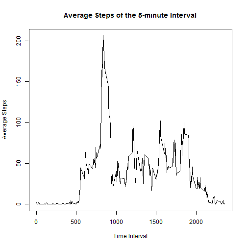

# Reproducible Research - Peer Assessment 1 - June 2015

This file contains the submission for the Peer Assessment 1 for the Reproducible Research Coursera Course. This is an Article that include both text and R code.

## Download and Unzip Files

The code below downloads the zip file from the URL and unzips the file. This code should be run directly in the console, and is not executed as part of knitr.


```r
if(!file.exists("activity.zip")){
    url <- "https://d396qusza40orc.cloudfront.net/repdata%2Fdata%2Factivity.zip"
    download.file(url,destfile="activity.zip")
    unzip("activity.zip", exdir = ".")
}
```

## Data preprocessing step

The code below reads the csv file. There is no preprocessing as the NA values are read as it is.


```r
activities <- read.csv("activity.csv")
```

## Analysis 1: What is mean total number of steps taken per day?

For this analysis, the missing data rows are excluded by setting na.rm = TRUE

The code below calculates the total number of steps taken per day and created a histogram of the total number of steps taken each day.


```r
TotalStepsTakenPerDay <- tapply(activities$steps, activities$date, FUN=sum, na.rm=TRUE)
hist(TotalStepsTakenPerDay, col="blue", xlab = "Steps Per Day", main="Total Number of Steps Taken Each Day")
```

 

The code below calculates and prints the mean and median of the total number of steps taken per day using TotalStepsTakenPerDay calculated previously.


```r
mean(TotalStepsTakenPerDay)
```

```
## [1] 9354.23
```

```r
median(TotalStepsTakenPerDay)
```

```
## [1] 10395
```

## Analysis 2: What is the average daily activity pattern?

The code below makes a time series plot of the 5-minute interval and the average number of steps taken, averaged across all days, of all the activities. For this analysis, the missing data rows are excluded by setting na.rm = TRUE


```r
AvgStepsTakenPerInterval <- aggregate(activities$steps, by=list(interval=activities$interval), FUN=mean, na.rm=TRUE)
names(AvgStepsTakenPerInterval) <- c("interval","avgSteps")
with(AvgStepsTakenPerInterval, plot(interval, avgSteps, type = "l" ,xlab="Interval", ylab = "Average Steps", main ="Average Steps of the 5-minute Interval"))
```

 

The code below calculates which 5-minute interval, on average across all the days in the dataset, contains the maximum number of steps.


```r
AvgStepsTakenPerInterval[AvgStepsTakenPerInterval$avgSteps==max(AvgStepsTakenPerInterval$avgSteps),"interval"]
```

```
## [1] 835
```

## Analysis 3: Imputing missing values

The code below calculates and reports the total number of missing values in the dataset (i.e., the total number of rows with NAs)


```r
nrow(activities[!complete.cases(activities),])
```

```
## [1] 2304
```

Since NA values can affect the result, we are replacing the NA values for a particular date with the average number of steps for that date. If none exists, values 0 is used. This new dataset with filled values is called newActivities. The nrow() function call shows that all the NA values have been replaced.


```r
AvgStepsTakenPerDay <- tapply(activities$steps, activities$date, FUN=mean, na.action = na.omit)
AvgStepsTakenPerDay[is.na(AvgStepsTakenPerDay)] <- 0
newActivities <- activities
nrow(newActivities[!complete.cases(newActivities),])
```

```
## [1] 2304
```

```r
newActivities$steps <- ifelse(is.na(newActivities$steps), AvgStepsTakenPerDay[newActivities$date], newActivities$steps)
nrow(newActivities[!complete.cases(newActivities),])
```

```
## [1] 0
```

The code below makes a histogram of the total number of steps taken each day based on the newActivities that has no NA values. 


```r
TotalStepsTakenPerDay <- tapply(newActivities$steps, newActivities$date, FUN=sum, na.rm=TRUE)
hist(TotalStepsTakenPerDay, col="red", xlab = "Steps Per Day", main="Total Number of Steps Taken Each Day (after filling NA values)")
```

 

```r
mean(TotalStepsTakenPerDay)
```

```
## [1] 9354.23
```

```r
median(TotalStepsTakenPerDay)
```

```
## [1] 10395
```

The code below calculate and reports the mean and median total number of steps taken per day with the newActivities that has no NA values. 


```r
mean(TotalStepsTakenPerDay)
```

```
## [1] 9354.23
```

```r
median(TotalStepsTakenPerDay)
```

```
## [1] 10395
```

Do these values differ from the estimates from the first part of the assignment? What is the impact of imputing missing data on the estimates of the total daily number of steps?

Comparing plot from Analysis 1 and this analysis, there is a diffrence in the estimates, but the trend looks similar. Though, mean number of steps were used for each date, it may be beneficial to explore other methods to replace the values. Such as median of the number of steps, or values based on the intervals across all days, etc.


## Analysis 4: Are there differences in activity patterns between weekdays and weekends?

The code below creates a new factor variable isWeekday with two levels - "weekday" and "weekend" indicating whether a given date is a weekday or weekend day. It uses the iSWeekday() function from timeDate.


```r
library(timeDate)
newActivities$date <- as.Date(newActivities$date)
newActivities$isWeekday <- ifelse(isWeekday(newActivities$date),"Weekday","Weekend")
newActivities$isWeekday <- as.factor(newActivities$isWeekday)
newActivities <- with(newActivities,aggregate(steps, by=list(isWeekday, interval), FUN=mean))
names(newActivities) <- c("isWeekday","interval","avgSteps")
```

The code below makes a ggplot containing a time series plot of the 5-minute interval and the average number of steps taken, averaged across all weekday days or weekend days. It shows the trends for weekdays and weekends separately.


```r
library(ggplot2)
ggplot(newActivities, aes(interval, avgSteps, group=isWeekday)) +
        geom_line(aes(linetype=isWeekday, color=isWeekday)) + facet_grid(isWeekday ~ .) +  
        labs(x = "Interval", y = "Average Number of Steps") +
        labs(title = "Average Number of Steps during Weekdays Vs. Weekends for different Intervals\n")
```

 
